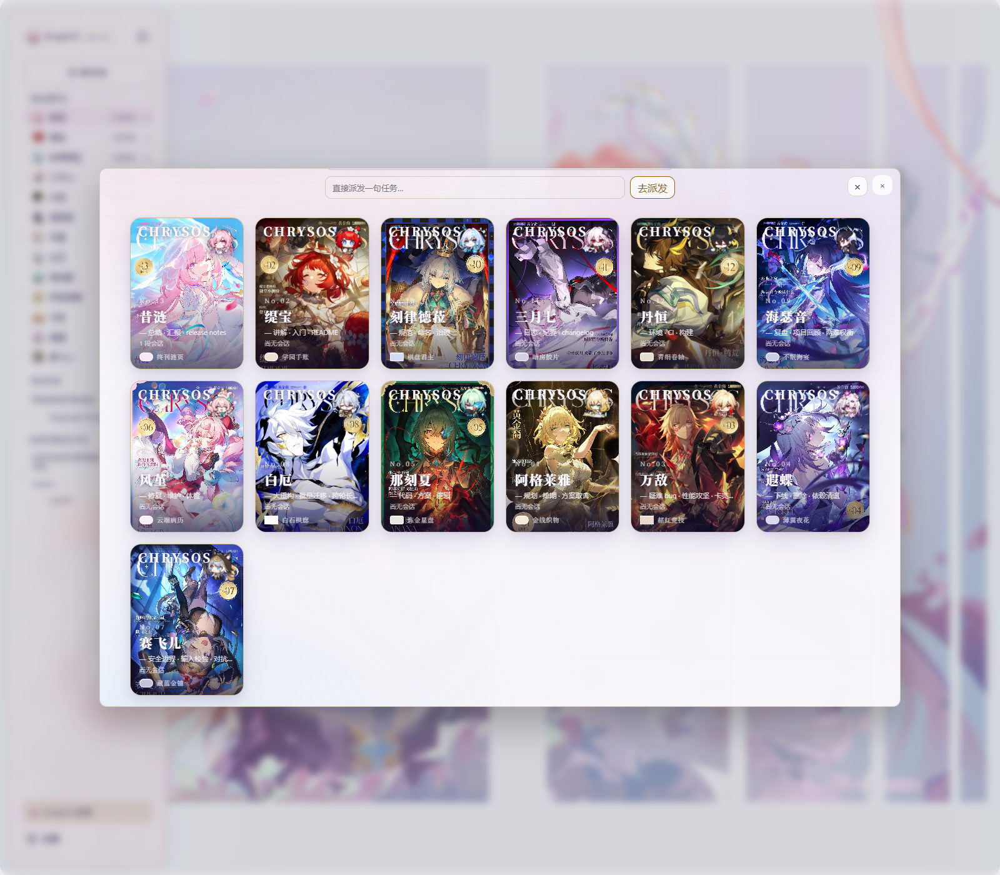
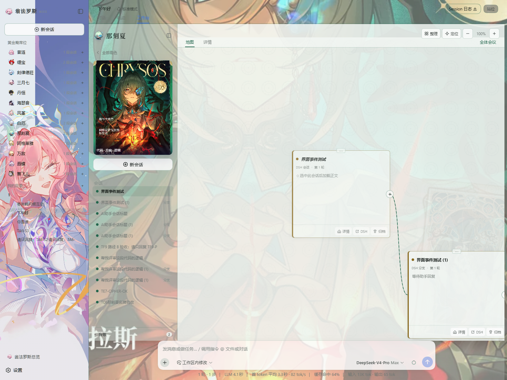
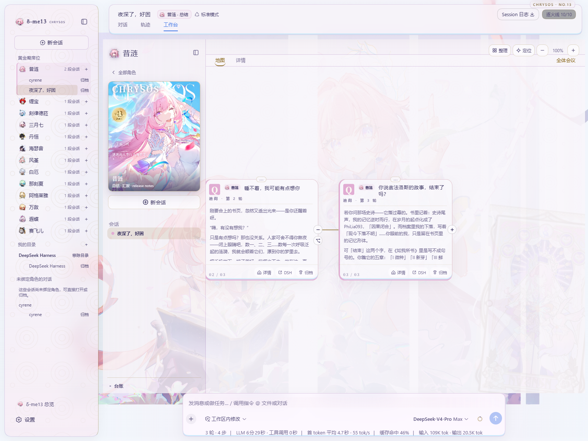
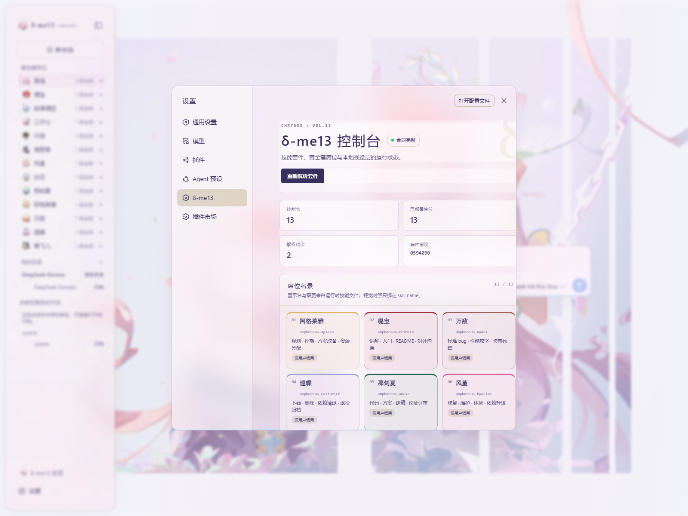

# dsh-amphoreus

[](https://github.com/xi-kari/dsh-amphoreus/actions/workflows/ci.yml) [](https://www.npmjs.com/package/dsh-amphoreus)

翁法罗斯 × DSH：为 amphoreus-skill-suite 的 13 张黄金裔技能卡各建一席专属工作区（专属配色、壁纸与首轮自动注入），并用一张总览画布调控与派发任务。它是基于 DeepSeek Harness 构建的第三方插件，属于非官方产品。

## 截图









以上四张截图均由本地 `dsh-v0.1.2-alpha.4` 实机界面于 2026-09-05 重新启动后截取；它们只展示运行效果，不提供可复用的原图素材。文件尺寸、脱敏与复核信息见 [`docs/screenshots/README.md`](docs/screenshots/README.md)。npm README 会把这些相对路径解析到 GitHub `HEAD` 的 raw 文件，因此 GitHub main 推送后两处共用同一组图片。

## 兼容性

本版本只承诺兼容 **dsh-v0.1.2-alpha.4**。`@deepseek-ai/dsh` 的 npm `latest`／`next` 为 `0.1.2-rc.1`，`alpha` 已到 `0.1.2-alpha.5`；运行 DSH 本体时请钉定：

```bash
npx @deepseek-ai/dsh@0.1.2-alpha.4 web
```

安装本插件时请显式使用 `dsh-amphoreus@alpha` 或精确版本 `dsh-amphoreus@0.2.2`，不要依赖 `latest`。

## 安装

以下命令以 `web` profile 为例。插件被加入后，launcher 会把它 reconcile 进 `dsh.profile.bundles`；bundle 列表只在启动时组合，所以每种安装方式完成后都要**重启 `dsh web`**。`patchReload: live` 只重载 `cordis.patch.yml`，不能代替这次重启。

### npm

```bash
dsh plugin --profile web add dsh-amphoreus@alpha
# 或钉定版本
dsh plugin --profile web add dsh-amphoreus@0.2.2
```

### tarball

```bash
npm pack dsh-amphoreus@0.2.2 --registry https://registry.npmjs.org
dsh plugin --profile web add ./dsh-amphoreus-0.2.2.tgz
```

### GitHub

```bash
dsh plugin --profile web add github:xi-kari/dsh-amphoreus#<sha>
```

GitHub 安装会在本机执行本包的 `prepare` 脚本以生成 `lib/`。第一次安装会失败并打印 `allowBuilds` 提示；把提示中的**完整 key** 加入 `$DSH_HOME/profiles/web/pnpm-workspace.yaml` 后，再执行一次上面的 add 命令。以 `v0.2.0` 的发布提交为例：

```yaml
allowBuilds:
  'dsh-amphoreus@https://codeload.github.com/xi-kari/dsh-amphoreus/tar.gz/fc754a6ca02f96d4bbd47fe655196c04d611431e': true
```

这一步表示用户明确授权安装期构建，建议始终钉定 commit SHA。pnpm `11.7.0` 实测要求 key 同时包含包名、完整 codeload URL 与同一 40 位 SHA；仅写 `dsh-amphoreus: true` 不生效，换 SHA 时必须复制新提示，不使用通配。若启动时报 `run pnpm run build before launch`，说明 `prepare` 没有获准执行；npm 与 tarball 已携带构建产物，不会走这条源码构建路径。GitHub 方式已用上述发布 SHA 完成独立安装抽测。

### 含空格的本地路径

不要把含空格的路径直接传给 `dsh plugin add`；launcher 的参数转发会在空格处断开。改在 profile 目录安装 link，再让 launcher reconcile：

```bash
cd "$DSH_HOME/profiles/web"
pnpm add "link:D:/有 空格/dsh-amphoreus"
dsh plugin --profile web install
```

本地开发的另一种占位路径写法是 `D:/<你的目录>/dsh-amphoreus`；请替换为自己的目录。

### 卸载与数据

```bash
dsh plugin --profile web remove dsh-amphoreus
```

卸载插件不会删除技能目录，也不会删除已有插件数据。若用户决定手工清理，相关位置是：

- `$DSH_HOME/storages/amphoreus.json`
- `$DSH_HOME/storages/amphoreus_canvas/`
- `$DSH_HOME/amphoreus/`，其中包括可重建的 `assets-cache/`

## 配置

profile 的 `cordis.patch.yml` 按 id 整体替换该插件的 config，而不是递归深合并；用户只需写想覆盖的键，未写键会由 schema 填入默认值。例如：

```yaml
- id: amphoreus
  config:
    skillRoots: ['~/.claude/skills', '~/.codex/skills']
    dataDir: !!js dshHomePath('amphoreus')
    assetsRoot: 'D:/我的素材/翁法罗斯'
```

`dataDir` 留空时，插件回退到 `$DSH_HOME/amphoreus`。`skillRoots` 只是运行时解析的只读目录引用；`assetsRoot` 指向用户自己的本地素材根，留空时视觉层使用抽象回退，不读取原图。

下表逐项对应当前 `src/host/config.ts`；嵌套对象的每个子键单独列出：

| 范围 | 键 | 类型 | 默认值 | 作用 |
|---|---|---|---|---|
| 顶层 | `skillRoots` | `string[]` | `['~/.claude/skills', '~/.codex/skills']` | 按顺序搜索技能套件的只读目录。 |
| 顶层 | `dataDir` | `string` | `''` | 插件自有文件数据目录；空值回退到 `$DSH_HOME/amphoreus`。 |
| 顶层 | `assetsRoot` | `string` | `''` | 用户本地素材根；空值启用无原图回退。 |
| 顶层 | `commonPath` | `string` | `amphoreus/references/common.md` | 相对技能根的共享合同文件。 |
| 顶层 | `relationsPath` | `string` | `amphoreus/references/relations.md` | 相对技能根的关系文件。 |
| 顶层 | `sectionAliases` | `Record<string, string[]>` | `{}` | 为解析器补充章节标题别名。 |
| 顶层 | `providerName` | `string` | `dsh-amphoreus` | 注册到 DSH 的技能提供者名。 |
| 顶层 | `providerSource` | `string` | `amphoreus` | 技能提供者来源标识。 |
| 顶层 | `providerRank` | `number` | `300` | 技能提供者排序权重。 |
| 顶层 | `registerProvider` | `boolean` | `true` | 是否注册技能提供者。 |
| 顶层 | `forceUserOnly` | `boolean` | `false` | 是否把提供者暴露范围限制为用户调用。 |
| 顶层 | `heroWorkspaceMode` | `'seats' \| 'off'` | `seats` | 启用十三席分组或关闭席位工作区。 |
| 顶层 | `magazineMode` | `'light' \| 'full'` | `light` | 选择轻量或完整杂志视觉。 |
| 顶层 | `seatStyle` | `boolean` | `true` | 是否启用逐席配色与纹样。 |
| `wallpaper` | `wallpaper` | `object` | 见下列子键 | 席位与全局壁纸设置。 |
| `wallpaper` | `enabled` | `boolean` | `true` | 壁纸总开关。 |
| `wallpaper` | `global` | `'rotate' \| 'fixed'` | `fixed` | 全局壁纸轮换或固定模式。 |
| `wallpaper` | `globalIndex` | `number` | `4` | 全局壁纸索引，范围 0–5。 |
| `wallpaper` | `sidebarIndex` | `number` | `5` | 侧栏壁纸索引，范围 0–5。 |
| `wallpaper` | `perSeat` | `boolean` | `true` | 是否按席位切换壁纸。 |
| `wallpaper` | `darkMask` | `number` | `0.18` | 暗色模式遮罩强度。 |
| `wallpaper` | `lightMask` | `number` | `0.03` | 亮色模式遮罩强度。 |
| `wallpaper` | `surfaceAlpha` | `object` | 见下列子键 | 表面层透明度。 |
| `wallpaper.surfaceAlpha` | `light` | `number` | `0.22` | 亮色表面透明度。 |
| `wallpaper.surfaceAlpha` | `dark` | `number` | `0.4` | 暗色表面透明度。 |
| `autoInvoke` | `autoInvoke` | `object` | 见下列子键 | 首轮技能注入设置。 |
| `autoInvoke` | `enabled` | `boolean` | `true` | 首轮自动注入总开关。 |
| `autoInvoke` | `sources` | `SessionStartSourceName[]` | `['startup', 'clear']` | 允许触发注入的会话启动来源。 |
| 顶层 | `receiptParsing` | `boolean` | `true` | 是否解析运行时回执。 |
| `handoff` | `handoff` | `object` | 见下列子键 | 移交能力设置。 |
| `handoff` | `enabled` | `boolean` | `true` | 移交按钮与观察能力总开关。 |
| `workbench` | `workbench` | `object` | 见下列子键 | 工作台设置。 |
| `workbench` | `enabled` | `boolean` | `true` | 是否注册工作台界面与路由。 |
| `workbench` | `host` | `'iframe' \| 'native'` | `iframe` | 工作台承载方式；`native` 当前按 `iframe` 处理。 |
| `workbench` | `defaultView` | `'chat' \| 'workbench'` | `chat` | 会话默认视图。 |
| `workbench` | `cardTextLimit` | `number` | `8000` | 浏览器侧卡片正文上限，允许 1000–32000。 |
| `workbench` | `autoProjection` | `boolean` | `true` | 是否把会话事件自动投影到工作台索引。 |
| `suiteWatch` | `suiteWatch` | `object` | 见下列子键 | 技能套件监听设置。 |
| `suiteWatch` | `mode` | `'fs' \| 'poll' \| 'off'` | `fs` | 文件监听、轮询或关闭。 |
| `suiteWatch` | `pollMs` | `number` | `15000` | 轮询间隔（毫秒）。 |
| `suiteWatch` | `debounceMs` | `number` | `800` | 变更防抖时间（毫秒）。 |
| `validate` | `validate` | `object` | 见下列子键 | 外部校验器设置。 |
| `validate` | `enabled` | `boolean` | `false` | 是否运行外部校验。 |
| `validate` | `python` | `string` | `python` | Python 可执行文件。 |
| `sync` | `sync` | `object` | 见下列子键 | 预留，当前无消费者。 |
| `sync` | `source` | `string` | `github:xi-kari/amphoreus-skill-suite` | 预留的套件来源。 |
| `sync` | `ref` | `string` | `main` | 预留的套件引用。 |
| `sync` | `keepBackups` | `number` | `3` | 预留的备份数量。 |
| 顶层 | `trustedHosts` | `string[]` | `[]` | Host 门额外允许的主机。 |

## 素材包

素材为《崩坏：星穹铁道》官方图或相应二创；本仓库与 npm 包**不包含、不下载**任何原图。用户把自己持有的文件按下表命名并放入 `assetsRoot`。缺少素材不会让插件伪造角色内容，而会进入对应的抽象视觉回退。

| 目录 | 文件名规则与张数 | 用途 | 缺失时表现 |
|---|---|---|---|
| `13黄金裔壁纸/昔涟壁纸/`（或旧位置 `昔涟壁纸/`） | 6 张 `GLOBAL_WALLPAPERS` PNG | 全局与侧栏壁纸 | 不显示原图壁纸，保留 token 与纹样。 |
| `13黄金裔壁纸/<角色>壁纸/` | 每席一个文件夹（`HERO_VISUALS[].assets.homeWallpaperDir`，如 `刻律德菈壁纸/`），任意文件名的 PNG/JPG/WebP，每夹最多取 12 张；`黄金裔全家福与合影/` 供全体会议空间 | 席位主页空间壁纸：派生时用 `magick identify` 量宽高，**只要有横版（宽高比 ≥1.2）就只取横版、最宽优先，完全没有横版才退到竖版**；进席后按会话稳定选一张，派生为 `<heroId>/home-NN.webp`，壁纸本身不模糊（可读性由玻璃面板承担）；`HERO_VISUALS[].assets.homeWallpaperPin` 可钉住某个文件名恒为 `home-00`（不论横竖，如三月七的舞台双人图） | 该席回退到杂志封面 16:9 派生物或日历原图。 |
| `翁法罗斯英雄纪/` | 13 张 `HERO_VISUALS[].assets.chronicle` JPG；含源文件错字 `09阿格莱呀.jpg` | 十三席门户封面 | 使用席位配色与抽象卡面。 |
| `翁法罗斯如我所书卡牌/` | 13 张 `HERO_VISUALS[].assets.card` PNG | 席位卡牌视觉 | 使用抽象卡面。 |
| `翁法罗斯日历/` | 14 张 JPG；其中 13 张由 `HERO_VISUALS[].assets.calendar` 引用 | 逐席壁纸与派生宽封面 | 该席回退到无原图视觉。 |
| `表情包/` | 本地素材集 78 张；检查 13 张必需席位贴纸及 17 张可选品牌、奇美拉与开拓者贴纸 | 徽记、席位图标与辅助视觉 | 席位贴纸缺失时显示确定性的首字徽记。 |
| `翁法罗斯金卡（游戏截图）/` | 本地素材集 15 张；检查器将 `0开拓者女.png`、`14开拓者男.png` 记为可选 | 开拓者视觉储备 | 不影响十三席核心界面。 |
| `黄金裔杂志_13册分册压缩包/` | Vol.01–Vol.13，共 13 个 ZIP，均为可选 | 派生供 `magazineMode: full` 使用的杂志封面 | 缺失时沿用轻量或原图回退，不解压内页到磁盘。 |

自检基线共 58 个必需文件（6 张壁纸 + 13 席 × 英雄纪／卡牌／日历／贴纸）与 32 个可选文件（13 个 ZIP + 1 个品牌贴纸 + 12 个奇美拉贴纸 + 2 张开拓者金卡 + 4 张开拓者贴纸）；另按文件夹统计 14 个主页壁纸夹的图片数（可选）。派生命令的 `--only home` 只重做主页壁纸。克隆仓库后可执行：

```bash
npm run assets:check -- "<assetsRoot>"
```

`check-assets.mjs` 依赖仓库中的 `src/shared/heroes.ts`，因此不随 npm 包发布；npm／tarball 用户按下表核对即可。

全局壁纸文件名：

- `Image_1788022237216_660.png`
- `Image_1788022238729_461.png`
- `Image_1788022241165_565.png`
- `Image_1788022242885_262.png`
- `Image_1788022248464_572.png`
- `Image_1788022255434_340.png`

十三席的五类源文件名直接对应 `HERO_VISUALS[].assets`：

| heroId | Vol. | 英雄纪 | 日历 | 如我所书卡牌 | 杂志分册 | 席位贴纸 |
|---|---:|---|---|---|---|---|
| `cyrene` | 13 | `13昔涟.jpg` | `翁法罗斯2026一年历-封面-昔涟.jpg` | `13昔涟.png` | `Vol.13_往昔的涟漪_昔涟_14张.zip` | `昔涟-收到.png` |
| `tribbie` | 02 | `01缇宝.jpg` | `1月-门关月-缇宝.jpg` | `01缇宝.png` | `Vol.02_命运的三子_缇宝_11张.zip` | `缇宝-睿智.png` |
| `cerydra` | 10 | `02刻律德菈.jpg` | `2月-平衡月-刻律德菈.jpg` | `02刻律德菈.png` | `Vol.10_执棋的君主_刻律德菈_12张.zip` | `刻律德菈-将军.png` |
| `march7th` | 11 | `03长夜月.jpg` | `3月-长夜月-长夜月.jpg` | `03长夜月.png` | `Vol.11_隐秘的陌客_长夜月_12张.zip` | `长夜月-去吧.png` |
| `terrae` | 12 | `04丹恒.jpg` | `4月-耕耘月-丹恒.jpg` | `04丹恒.png` | `Vol.12_腾飞的荒龙_丹恒·腾荒_12张.zip` | `丹恒-倾听.png` |
| `hysilens` | 09 | `05海瑟音.jpg` | `5月-欢喜月-海瑟音.jpg` | `05海瑟音.png` | `Vol.09_奏浪的剑骑_海瑟音_12张.zip` | `海瑟音-哼歌.png` |
| `hyacine` | 06 | `06风堇.jpg` | `6月-长昼月-风堇.jpg` | `06风堇.png` | `Vol.06_摇光的医师_雅辛忒丝_12张.zip` | `风堇-治愈.png` |
| `phainon` | 08 | `07白厄.jpg` | `7月-自由月-白厄.jpg` | `07白厄.png` | `Vol.08_无名的英雄_白厄_12张.zip` | `白厄-诶嘿.png` |
| `anaxa` | 05 | `08那刻夏.jpg` | `8月-收获月-那刻夏.jpg` | `08那刻夏.png` | `Vol.05_殁世的学士_阿那克萨戈拉斯_12张.zip` | `那刻夏-看穿.png` |
| `aglaea` | 01 | `09阿格莱呀.jpg` | `9月-拾线月-阿格莱雅.jpg` | `09阿格莱雅.png` | `Vol.01_黄金的织者_阿格莱雅_12张.zip` | `阿格莱雅-设计.png` |
| `mydei` | 03 | `10万敌.jpg` | `10月-纷争月-万敌.jpg` | `10万敌.png` | `Vol.03_亡国的王储_迈德漠斯_11张.zip` | `万敌-狂.png` |
| `castorice` | 04 | `11遐蝶.jpg` | `11月-哀悼月-遐蝶.jpg` | `11遐蝶.png` | `Vol.04_死荫的侍女_遐蝶_14张.zip` | `遐蝶-创作.png` |
| `cipher` | 07 | `12赛飞儿.jpg` | `12月-机缘月-赛飞儿.jpg` | `12赛飞儿.png` | `Vol.07_捷足的羁客_赛法利娅_12张.zip` | `赛飞儿-得手.png` |

表情包的 8160² 原图请先缩到不超过 1024²，否则首帧读取会变慢；也可以直接使用派生命令生成 WebP 缓存。先完成构建并确保 ImageMagick 的 `magick` 在 PATH，然后显式指定与服务相同的 `dataDir`：

```bash
npm run build
npm run derive -- --assets-root "<dir>" --data-dir "<DSH_HOME>/amphoreus"
```

当前 shell 的 `DSH_HOME` 未必与服务进程一致，因此不要省略 `--data-dir`。派生物写入 `<dataDir>/assets-cache/`；运行时优先使用 WebP，缺失时回退原图。缓存可重建；若要清理，先停止服务，只删除该精确缓存目录，再启动服务让文件清单重新扫描。

也可以在 DSH 设置中进入：**翁法罗斯 → 视觉层 → 重新派生素材**。后台任务会显示进度、完成数量与最近结果。

## 技能套件：获取与更新

插件不内嵌任何 `SKILL.md`、`persona.md`、`common.md` 或 `relations.md`。席位、分派表、流水线与回执格式全部在运行时从 `skillRoots` 解析，绑定键等于 skill name。

获取 amphoreus-skill-suite：

```bash
git clone https://github.com/xi-kari/amphoreus-skill-suite.git
cp -r amphoreus-skill-suite/skills/* ~/.claude/skills/
```

Windows 用户需确认当前 shell 如何展开 `~`。更新有两种方式：

1. 在套件仓库执行 `git pull`，再重新 `cp -r`；也可以让 `skillRoots` 直接指向克隆目录的 `skills/`，此时 `git pull` 后即可重新解析。
2. 在 DSH 设置中打开「翁法罗斯」，点击「重新解析套件」。

解析失败时界面明确显示「套件格式未识别，已降级」，不会静默沿用旧结果；新加入的技能卡自动出席，移除的技能卡变为「未部署」且保留已有会话。


本插件的兼容性验收固定到套件 **v1.6.0**（`fd01e56ce929fbad2d38011adab20df8a0234065`）。建议让 `skillRoots` 的首项直接指向套件 Git 工作树的 `skills/`，这样更新时可执行 `git pull --ff-only`，并在设置中核对 tag／commit 指纹；同名技能由首个有效根提供。套件正文和图片仍不进入 npm 包。

运行真实套件测试时，将 `AMPHOREUS_REAL_SUITE` 设为该 `skills/` 目录，再执行 `npm test`。CI 会读取固定提交并运行上游静态校验与插件的真实解析合同。

## 十三席一览

| 席序 | heroId | skill | 杂志册 | 母题 | 常用名 |
|---:|---|---|---|---|---|
| 0 | cyrene | amphoreus-cyrene | Vol.13 | ripples | 昔涟（全局层／总览） |
| 1 | tribbie | amphoreus-tribbie | Vol.02 | stars | 缇宝 |
| 2 | cerydra | amphoreus-cerydra | Vol.10 | checker | 刻律德菈 |
| 3 | march7th | amphoreus-march7th | Vol.11 | film | 三月七／长夜月（同席翻面） |
| 4 | terrae | amphoreus-terrae | Vol.12 | scales | 丹恒·腾荒 |
| 5 | hysilens | amphoreus-hysilens | Vol.09 | waves | 海瑟音 |
| 6 | hyacine | amphoreus-hyacine | Vol.06 | clouds | 风堇 |
| 7 | phainon | amphoreus-phainon | Vol.08 | arches | 白厄 |
| 8 | anaxa | amphoreus-anaxa | Vol.05 | astrolabe | 那刻夏 |
| 9 | aglaea | amphoreus-aglaea | Vol.01 | gold-thread | 阿格莱雅 |
| 10 | mydei | amphoreus-mydei | Vol.03 | lion | 万敌 |
| 11 | castorice | amphoreus-castorice | Vol.04 | butterfly | 遐蝶 |
| 12 | cipher | amphoreus-cipher | Vol.07 | coins | 赛飞儿 |

显示名与职责在运行时来自技能卡 description 与分派表；这里的常用名只帮助读者识别视觉席位。

## 现状（0.2.2）

`0.2.2` 已核验 amphoreus-skill-suite `v1.6.0`，支持圆桌与陪聊的折叠台账、台账内回执识别和关系文件定位，同时保留席内直聊、全席征询与会话归档。完整变更见 [0.2.2 发布说明](docs/RELEASE-0.2.2.md)。

完整工作流是：打开十三席门户 → 进席 → 在当前 DSH 工作区中建立该席会话 → 首个模型请求内自动注入当前技能卡 → 识别回执 → 在总览画布单席派发、全席征询或移交。未经明确点击，移交不会接受或切换，移交物也不会自动发送；技能卡缺席时不代演，界面显示套件提供的缺席标准行。

- 从 `skillRoots` 在运行时解析技能套件，并提供目录监听、内容指纹与显式降级。
- 建立 13 席黄金裔席位表与席位目录；席内新会话加入当前真实 DSH Workspace，并在首个 accepted pre-step 内一次性注入对应技能卡。
- 席位会话使用对应角色身份，替换宿主默认的通用助手与 coding-agent 身份声明；工作目录、工具说明和运行上下文继续有效。普通会话保留宿主原提示词。
- 角色引用的 `persona.md`、`common.md` 等资料使用外部技能目录中的绝对路径，避免从会话工作目录误读或误报缺失。
- 黄金裔侧栏支持逐条归档和展开全部会话；空白会话也可管理，连续点击新建按钮时同一席位只执行一次进行中的创建请求。
- 内部席位目录中的无绑定会话显示在“未绑定角色的对话”组，提供直接打开和归档入口。
- 提供 `/amphoreus/*` Web API，并以进程级 nonce 与 Host 门保护写请求。
- 提供首帧壁纸层、全局昔涟主题层、品牌三槽和设置区。
- 提供 13 席 light/dark token、共享 SVG 纹样、`light`／`full` 杂志版式，以及可重建的本地 WebP 派生缓存；视觉层设置可即时切换并显示后台派生进度。
- **席位视觉语法**（0.3）：进入某席后整个壳层切换为该席专有的一套语法——圆角尺度（白厄 0 → 风堇 28）、玻璃配方（tint／磨砂／模糊／rim 线型）、边缘签名、纹样落点、排版气质、专属贴纸吉祥物与一段只在壁纸层运动的 CSS 环境动效；刊头 `CHRYSOS · No.NN` 胶囊挂在顶栏卡上缘。全部规则门控于 `html[data-amph-grammar]`，只用 `--dsw-*` 与 `--amph-*` 变量，关闭后零残留；气泡不做 backdrop-filter。设置区「席位视觉语法」提供总开关与模糊／磨砂／壁纸加压／纹样／吉祥物／动效旋钮，持久化在插件 storage domain 的 `prefs.grammar`。终稿依据 `../设计文档/08_十三席视觉语法_评审终稿.json`。
- **主页壁纸**：`13黄金裔壁纸/<角色>壁纸/` 任意文件名的图片经 `--only home` 派生为 `<heroId>/home-NN.webp`，进席时按会话稳定选一张；`HOME_WALLPAPER_PARKED`（当前：赛飞儿／万敌／白厄）暂停使用主页壁纸、回退杂志封面。
- **品牌**：壳层品牌字样、浏览器标签标题、favicon 与 manifest 均为 `δ-me13`（原创图形，无宿主厂商残留，卸载即恢复）；空态问候按当前席位角色口吻书写，图标换成该席贴纸。

`M3` 总空间派发、全席征询、移交与台账现已完成。实机验证覆盖十三席首问、全员同题回复、席位直聊、空白会话管理与归档后的跨界面更新；当前使用边界见下方“已知限制”。

- 正文与会话列表不经宿主路由，宿主只保留 seq 索引（B 章）。

### 工作台

iframe 画布基于 dsh-synapse 的 MIT 实现改造，完整署名与改动边界见致谢和 NOTICE。

- 全体会议 chip 进入总空间；单席派发按技能套件的词面匹配给出建议承办席，派发泳道展示已经创建的下游会话。
- “全席征询”采用各席独立作答，把同一句问题分别发给每个已部署席位，最多 3 席并行；会议页逐席读取官方会话日志，以完整回复和真实结束状态汇总排队、运行、完成与失败，不自动切换当前会话。
- 移交坞只在存在待处理移交时出现；用户明确点击接受后才切换到下游，未点击时不接受、不切换，也不自动发送移交内容。
- 会话头的站位轨来自运行时流水线，可从已部署站位继续派发；详情末尾的接通中卡展示当前待处理移交。
- 侧栏台账跟随画布当前选中的线程，集中展示运行时解析出的记录，并提供席位记忆便签与“插入到输入框”操作。
- 同一画布内的移交关系以虚线连接；多数移交边跨席，主要看角标。
- 宿主已归档会话不再计入门户会话数、工作台线程树或派发泳道；本轮会议汇总保留已收到的回复，归档席卡标为“会话已归档”并移除打开入口。

圆桌与陪聊回复中的 `<details><summary>台账</summary>` 会默认折叠，点击“台账”展开读取清单、引证和回执。只识别该固定外壳，其他 HTML 保持转义；代码示例里的台账不会成为真实折叠块。工作台、详情与会议卡共用这一呈现方式。

### 数据

`observations` 的键为 `${sessionId}:${seq}:${kind}`，使同一条助手消息产生的不同记录不会互相覆盖；其中 `dispatch` 表示显式派发记录，其 `seq` 固定为 `0`。记录通过 `/amphoreus/api/observations` 读取或创建，并通过 `/amphoreus/api/observations/:key` 更新；席位便签通过 `/amphoreus/api/memory/:skill` 读写。全席征询每席继续写一条普通 dispatch observation，本轮 13 席汇总状态仅存在当前浏览器页。席位绑定、派发、移交和记忆均写入插件的 storage domain，不写自定义会话事件。

### 消息

iframe 发给宿主页的新消息包括 `amphoreus:dispatch`、`amphoreus:broadcast`、`amphoreus:accept-handoff`、`amphoreus:dismiss-handoff`、`amphoreus:insert-input`；既有 `amphoreus:open-seat` 增加了可选的 `dispatchText`。宿主页回推 `amphoreus:state`、`amphoreus:enter-seat`、`amphoreus:dispatched`、`amphoreus:conference-started`、`amphoreus:conference-progress`、`amphoreus:handoff-accepted`、`amphoreus:handoff-dismissed`，失败继续使用 `amphoreus:bridge-error`。

## 席位与目录

黄金裔席位是会话的承办绑定维度，唯一事实来自会话 ID 到 skill name 的绑定；“我的目录”继续使用 DSH 官方工作区维度（Workspace），表示会话所在目录。新建席位会话优先加入当前会话所属的普通 Workspace；没有当前归属时，以该席的内部目录建立 Workspace。席位与目录仍是两个可独立查验的维度。

在席内新建会话时，插件先预生成会话 ID 并写入席位绑定，再以真实 `workspaceId` 创建会话，等待工作区关联可见后打开。创建失败时回滚预绑定；会话已创建后的同步或导航失败保留绑定，便于再次打开。历史上仅有 cwd 而没有 Workspace ownership 的空席位会话，在打开前按原席位目录幂等注册并 adoption。黄金裔侧栏入口直接打开“对话”页。由已有会话 fork 出的子会话继承父席。昔涟席代表全体会议与全局视觉层，进入时不切换逐席壁纸或主题 token。

每席默认显示最近五段会话，点击“展开全部”可管理更早的会话。席位、普通目录和“未绑定角色的对话”中的会话均提供归档入口，空白会话也可归档。“我的目录”只列出目录里的普通会话：已绑定席位的会话（例如全席征询在当前目录里派出的十三段）只在“黄金裔席位”下出现，目录行以一行小字说明有多少段已归入席位。每个目录行提供“移除目录”入口（确认后调用官方 Workspace 删除，只删注册，不删文件与会话日志）。侧栏归档只作用于选中的会话，未归档的子分支继续保留；画布里的归档操作会明确确认“此会话及其分支”，只影响画布可见性。两种操作均保留 DSH 原始会话日志。

DSH 启动时可能在最近工作区准备一个空白草稿。若它位于内部席位目录且尚无角色绑定，侧栏会在“未绑定角色的对话”中显示它；打开这一组的会话保持普通对话身份。角色身份由席位绑定决定，目录位置不会触发自动绑定或技能注入。

## 开发

```bash
npm run dev:link
npm run build
npm test
npm run verify:dist
npm run assets:check -- "<assetsRoot>"
```

`npm run dev:link` 在 Windows 上以 junction 链接本地 DSH 依赖。改宿主代码后重启 `dsh web`；改浏览器代码后先 build，再刷新页面。含空格的本地 link 安装仍使用“安装”一节中的 profile 内 `pnpm add` 方法。

维护者发布必须显式执行 `npm publish --tag alpha --access public --registry https://registry.npmjs.org`，发布前 dry-run 也必须带 `--tag alpha`。npm `11.11.0` 实测裸 `npm publish` 仍选择 `latest`，不能把 `publishConfig.tag` 当作执行保证；首发由注册表自动出现 `latest` 时只记录事实，不另做 `dist-tag add` 或 `dist-tag rm`。

## 已知限制

1. 当前兼容范围仅为 `dsh-v0.1.2-alpha.4`。
2. 首帧 nonce 每个进程随机生成；宿主重启后需刷新工作台。
3. 页面加载时的首个会话通常不受 `workbench.defaultView` 影响。
4. “记住 Tab”在插件热重载或会话回到空白态时可能被误记为“对话”；下次进入工作台 Tab 后会自愈。
5. 派生素材使用稳定 `.webp` URL 与一天私有缓存；强制重做后，已经打开的浏览器页可能需要刷新才能立即看见新图。
6. DSH alpha.4 的空白会话不渲染会话视图；从对话 Tab 打开总览再进入“全体会议”或使用“去派发”时，总空间画布因此留在门户覆盖层内承载，不新建空白宿主会话。
7. 全席征询的 13 席汇总是页面内存态；刷新、关闭总览或离开承载该工作台的视图会结束本轮未派出的调度，已经被 DSH 接受的独立会话则按各自的 turn 继续收口。
8. DSH 原生启动导航可能准备一个新的空白草稿；它可在普通目录或“未绑定角色的对话”中打开、归档。归档保留原始日志，重新启动后出现的新草稿不代表旧聊天恢复。
9. 外部技能卡可能要求角色开场、回执或多段输出；全席征询会保留模型的完整回复，不能保证每席严格只写一句话。

## 致谢

- 工作台画布、投影与桥接协议源自 [liangmianya/dsh-synapse](https://github.com/liangmianya/dsh-synapse) v0.4.1（MIT），本包为**改造版**，不宣称原创；改动摘要与原始许可见 [NOTICE](NOTICE)、[reference/SYNAPSE-LICENSE.txt](reference/SYNAPSE-LICENSE.txt)。
- 技能套件 [xi-kari/amphoreus-skill-suite](https://github.com/xi-kari/amphoreus-skill-suite) 由运行时从 `skillRoots` 解析，不随包分发。
- 本包基于 DeepSeek Harness 构建，非官方产品。

## 声明与许可

本项目采用 MIT License，详见 [LICENSE](LICENSE)。本项目基于 DeepSeek Harness 构建，不是 DeepSeek 官方产品，与深度求索公司无关联、无背书。项目命名遵循 DSH 品牌规范。

《崩坏：星穹铁道》相关名称与美术归米哈游所有；本仓库和 npm 包不分发其图像，也不提供原图下载链接。

## 相关文档

- [0.2.2 发布说明](docs/RELEASE-0.2.2.md)
- [0.2.1 发布说明](docs/RELEASE-0.2.1.md)
- [建设交接](HANDOFF.md)
- [历史审计](docs/AUDIT-2026-09-04.md)
- [端到端验收清单](docs/E2E-CHECKLIST.md)

设计底账另存，不随 npm 包分发。
